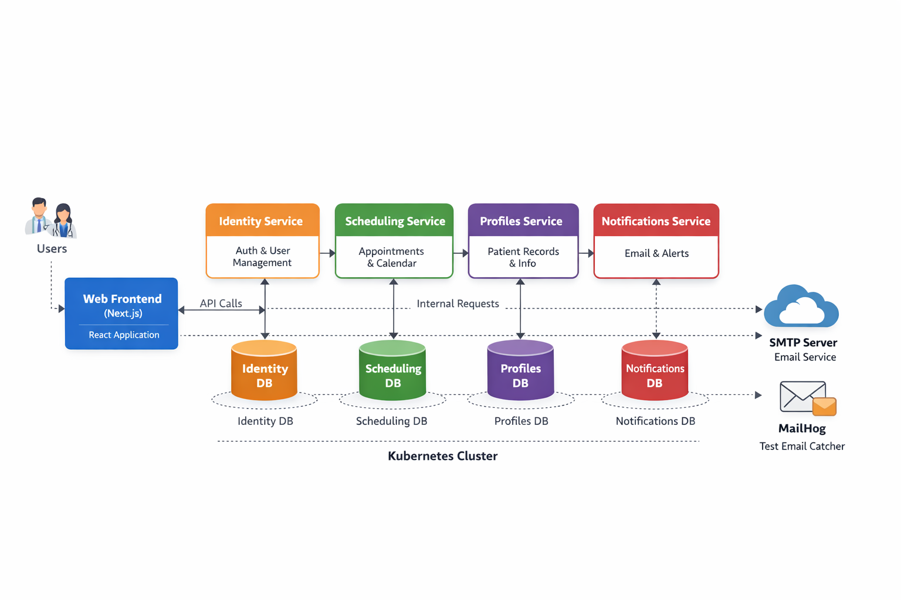

# ClinicFlow — Clinic Appointment Platform (Microservices)

ClinicFlow is a simple-but-powerful, production‑style clinic appointment system built with **microservices**, **separate databases per service**, and a clean **patient/staff/admin web UI**. It is designed for enterprise demos and real-world platform discussions (availability, persistence, observability, GitOps, Kubernetes readiness).

---

## What problem ClinicFlow solves

Most small to mid-sized clinics still manage booking and visit documentation through manual processes (phone calls, WhatsApp, paper notes), which leads to:

* Double bookings and schedule clashes
* Poor visibility into provider availability
* Weak auditability of patient visit notes
* Fragmented records across tools
* No reliable confirmation/reminder flow

ClinicFlow solves this by providing:

* **Real-time appointment booking** with “Any available provider” assignment
* **Patient self-service** (book, cancel, reschedule)
* **Staff daily schedule** with **visit notes** per appointment
* **Notifications** (confirmation/reminders) with delivery logs
* **True microservices** boundaries with **one Postgres database per service**

---

## Architecture diagram

[](docs/Architectural_Diagram.png)

---

## High-level architecture

ClinicFlow consists of **4 backend services + 1 web UI**:

### Backend services

1. **Identity Service** (Auth & RBAC)

* Register/Login
* JWT issuance
* Role-based access control: `PATIENT`, `STAFF`, `ADMIN`

2. **Scheduling Service** (Clinic scheduling domain)

* Clinic services catalog (e.g., Consultation)
* Providers management (doctors)
* Availability discovery
* Booking / cancel / reschedule
* Integrates with Notifications over HTTP

3. **Profiles Service** (Patient & staff profiles + clinical notes)

* Patient profile management
* Staff views patient profile
* Visit notes linked to appointment IDs

4. **Notifications Service** (Email notifications + delivery logs)

* Booking confirmations
* Appointment reminders
* Delivery logging (audit trail)

### Frontend

5. **Web UI** (Next.js)

* Patient portal
* Staff portal
* Admin console (user promotion + provider creation)

### Data layer

Each backend service owns its own **Postgres instance**:

* `identity-db`
* `scheduling-db`
* `profiles-db`
* `notifications-db`

This enforces service boundaries and clean data ownership.

---

## Key workflows

### Patient flow

1. Register/Login
2. Book appointment (select service + date + time)
3. System assigns **first available provider**
4. Confirmation email is sent (Notifications)
5. Patient can view appointments, cancel, or reschedule

### Staff flow

1. Login as STAFF
2. View daily schedule
3. Select appointment
4. View patient profile (Profiles)
5. Write visit note (stored in Profiles DB)

### Admin flow

1. Login as ADMIN
2. Search user by email
3. Promote user role to `STAFF`
4. Create provider record for that staff user (Scheduling)

---

## Repository structure

```
clinicflow/
  services/
    identity/
    scheduling/
    profiles/
    notifications/
  apps/
    web/
```

Each service/app is a **standalone project** with its own `package.json` and `pnpm-lock.yaml`.

---

## Tech stack

* **Backend:** NestJS (TypeScript)
* **Frontend:** Next.js (App Router) + Tailwind
* **Databases:** PostgreSQL (4 separate instances)
* **ORM:** Prisma
* **Notifications:** Nodemailer (MailHog for local demo)
* **Containerization:** Docker (multi-stage builds)
* **Kubernetes readiness:** health checks, env-based config, migration jobs

---

## Ports (local)

| Component     |   Port |
| ------------- | -----: |
| Identity      | `3000` |
| Scheduling    | `3002` |
| Profiles      | `3003` |
| Notifications | `3004` |
| Web UI        | `3005` |
| MailHog UI    | `8025` |
| MailHog SMTP  | `1025` |

---

## Environment variables

### Backend services

Each backend supports env-based configuration. **Do not commit real `.env` files**.
Use `.env.example` templates.

Common variables:

* `PORT`
* `DATABASE_URL`
* `CORS_ORIGINS` (optional; set for local only)

Scheduling-specific:

* `NOTIFICATIONS_BASE_URL`

Notifications-specific:

* `SMTP_HOST`
* `SMTP_PORT`
* `SMTP_FROM`

### Web UI

Local dev uses explicit service URLs.
In Kubernetes, UI should use **relative paths** routed by Ingress:

Local `.env.local` example:

```env
NEXT_PUBLIC_IDENTITY_API=http://localhost:3000
NEXT_PUBLIC_SCHEDULING_API=http://localhost:3002
NEXT_PUBLIC_PROFILES_API=http://localhost:3003
NEXT_PUBLIC_NOTIFICATIONS_API=http://localhost:3004
```

Kubernetes (Ingress) example:

```env
NEXT_PUBLIC_IDENTITY_API=/identity
NEXT_PUBLIC_SCHEDULING_API=/scheduling
NEXT_PUBLIC_PROFILES_API=/profiles
NEXT_PUBLIC_NOTIFICATIONS_API=/notifications
```

---

## Health checks

All backend services expose:

* `GET /health` → `200 OK`

This supports Kubernetes readiness/liveness probes.

---

## Database migrations (Prisma)

Migrations are managed per service.

Local development typically uses:

```bash
pnpm prisma migrate dev
```

For Kubernetes and CI/CD:

```bash
pnpm prisma migrate deploy
```

Recommended production pattern:

* Run migrations using a **Kubernetes Job per environment** before rolling out services.

---

## Local development

> You can run services individually (pnpm) or with Docker.

### 1) Install dependencies

Run inside each service/app folder:

```bash
pnpm install
```

### 2) Start backend services (dev)

Example (Identity):

```bash
cd services/identity
pnpm start:dev
```

Repeat for other services.

### 3) Start Web UI

```bash
cd apps/web
pnpm dev -- -p 3005
```

### 4) MailHog (for notifications demo)

Run MailHog locally and open:

* MailHog UI: `http://localhost:8025`

---

## Docker builds (multi-stage)

Each component includes a Dockerfile.

Examples:

```bash
# Identity
docker build -t clinicflow-identity:local ./services/identity

# Scheduling
docker build -t clinicflow-scheduling:local ./services/scheduling

# Profiles
docker build -t clinicflow-profiles:local ./services/profiles

# Notifications
docker build -t clinicflow-notifications:local ./services/notifications

# Web
docker build -t clinicflow-web:local ./apps/web
```

---

## Admin actions (making a staff user)

To enable a doctor/staff member:

1. Promote the user in Identity to role `STAFF`
2. Create a Provider record in Scheduling for that user

ClinicFlow includes an **Admin UI** for this under:

* `/admin/users`

Admin can:

* Search user by email
* Promote to STAFF
* Create provider with specialty

---

## API overview (high level)

### Identity

* `POST /auth/register`
* `POST /auth/login`
* `GET /me`
* Admin:

  * `GET /admin/users?email=...`
  * `PATCH /admin/users/:id/role`

### Scheduling

* `GET /services`
* `POST /providers` (ADMIN)
* `GET /availability?date=YYYY-MM-DD&serviceId=...`
* `POST /appointments` (PATIENT)
* `GET /appointments/mine` (PATIENT)
* `DELETE /appointments/:id` (PATIENT)
* `PATCH /appointments/:id/reschedule` (PATIENT)
* `GET /appointments/provider/mine?date=...` (STAFF)
* `GET /appointments/:id`

### Profiles

* `GET /profiles/me` (PATIENT)
* `PATCH /profiles/me` (PATIENT)
* `GET /profiles/patient/:userId` (STAFF/ADMIN)
* `POST /visit-notes` (STAFF)
* `GET /visit-notes?appointmentId=...` (STAFF/ADMIN)

### Notifications

* `POST /notify/booking-confirmation`
* `POST /notify/reminder`
* `GET /notify/logs`

---

## Kubernetes deployment (overview)

ClinicFlow is designed for deployment into multiple Kubernetes environments (dev/staging/prod). A production-grade deployment typically includes:

* Container registry (GHCR/Harbor/ECR)
* Namespaces per environment
* Postgres x4 with PVC persistence
* Secrets per environment
* Ingress routing (single host + path-based routing)
* cert-manager TLS
* Prisma migrations via Kubernetes Jobs
* GitOps:

  * App repo (this repo)
  * GitOps repo (Helm/Kustomize manifests)
  * Argo CD per cluster

---

## Security & best practices

* No secrets committed to Git
* Env-based config
* Separate databases per service
* Health endpoints for orchestration
* Role-based access control
* Notifications and audit logs stored in DB

---

## Roadmap (recommended enhancements)

* Replace direct HTTP notifications with async event bus (NATS/RabbitMQ/Kafka)
* Add rate limiting (API gateway or ingress)
* Add request tracing (OpenTelemetry)
* Add full observability (Prometheus/Grafana/Loki/Alertmanager)
* Add Postgres operator for HA (CloudNativePG/Crunchy)
* Add backups + restore runbooks

---

## License

Internal / Demo project.

---

## Maintainers

* Maintainer: **BluDive DevOps Team**
* Project: **ClinicFlow**
